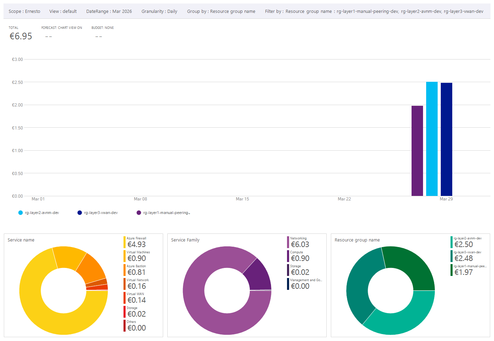
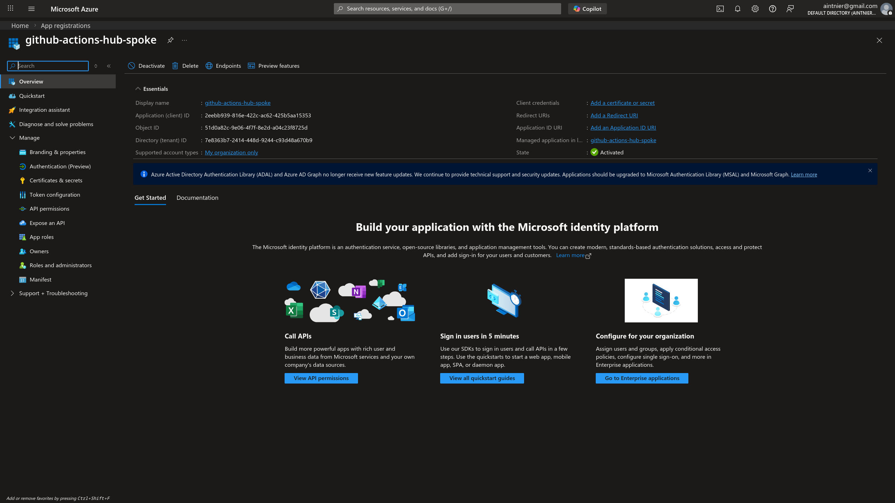
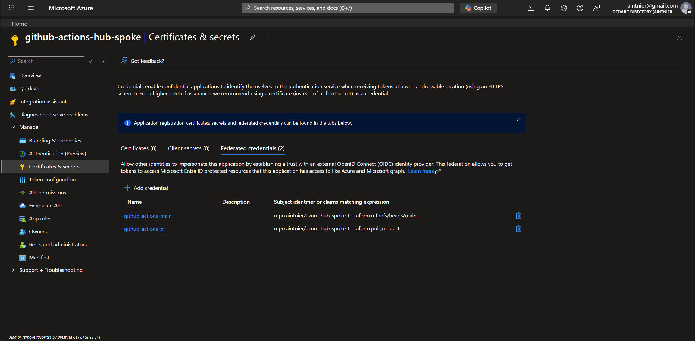
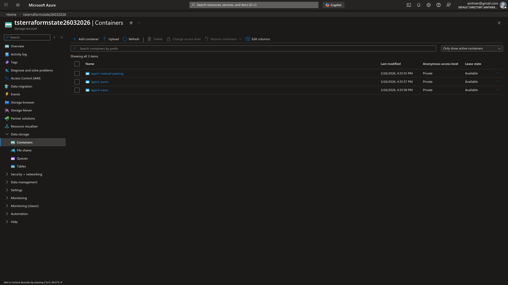
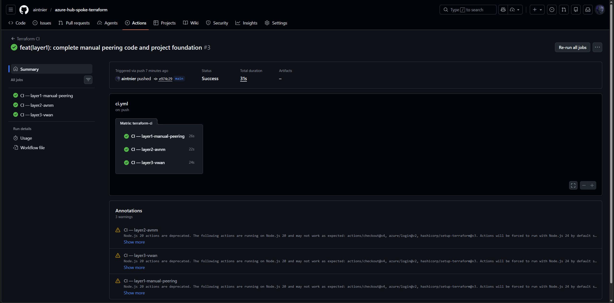
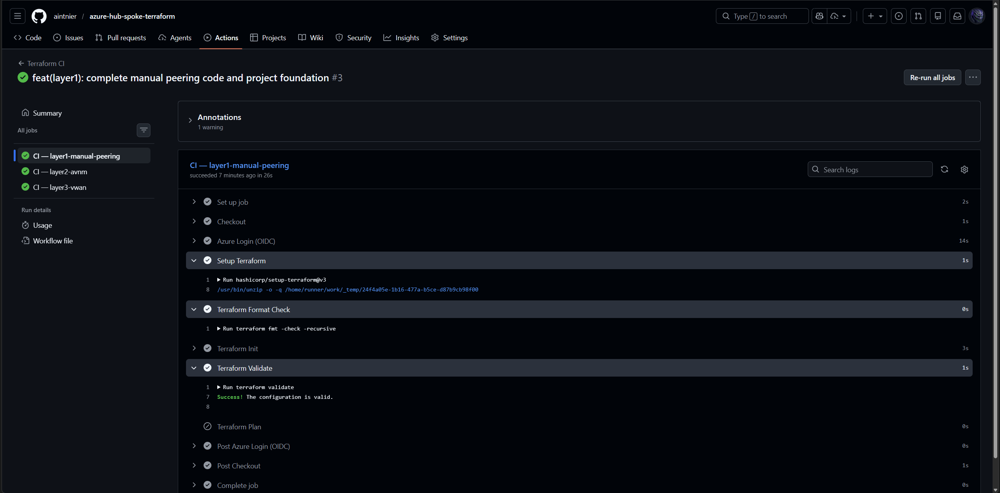

# Azure Hub-and-Spoke Topologies - Terraform & GitHub Actions

[](https://github.com/aintnier/azure-hub-spoke-terraform/actions/workflows/ci.yml)
[](https://github.com/aintnier/azure-hub-spoke-terraform/actions/workflows/deploy-layer1.yml)
[](https://github.com/aintnier/azure-hub-spoke-terraform/actions/workflows/deploy-layer2.yml)
[](https://github.com/aintnier/azure-hub-spoke-terraform/actions/workflows/deploy-layer3.yml)

[](https://azure.microsoft.com/)
[](https://www.terraform.io/)
[](https://docs.microsoft.com/en-us/azure/active-directory/develop/workload-identity-federation)

A portfolio project implementing three **production-grade Hub-and-Spoke network architectures** on Microsoft Azure, evolving from manual VNet Peering through AVNM policy-driven automation to a fully managed Virtual WAN - each layer provisioned via **Terraform** and validated through **GitHub Actions CI/CD** with **OIDC federated authentication**.

## Explore the Runbooks

Each layer's full deployment session is documented in its `RUNBOOK.md` - including
validation tests, control-plane telemetry, KQL queries, and engineering lessons learned.
For the most complete understanding of the project, I recommend reading them in sequence.

---

## Table of Contents

- [Azure Hub-and-Spoke Topologies - Terraform \& GitHub Actions](#azure-hub-and-spoke-topologies---terraform--github-actions)
  - [Explore the Runbooks](#explore-the-runbooks)
  - [Table of Contents](#table-of-contents)
  - [Architecture Overview](#architecture-overview)
  - [Skills Demonstrated](#skills-demonstrated)
  - [Layer Comparison](#layer-comparison)
  - [Cost Analysis](#cost-analysis)
    - [Summary of Cost Drivers](#summary-of-cost-drivers)
  - [Phase 0: Project Foundation](#phase-0-project-foundation)
    - [Zero-Trust Authentication (OIDC)](#zero-trust-authentication-oidc)
    - [Remote Terraform State](#remote-terraform-state)
    - [Continuous Integration (CI)](#continuous-integration-ci)
  - [Layer Details](#layer-details)
    - [Layer 1 - Manual VNet Peering](#layer-1---manual-vnet-peering)
    - [Layer 2 - Azure Virtual Network Manager (AVNM)](#layer-2---azure-virtual-network-manager-avnm)
    - [Layer 3 - Azure Virtual WAN (vWAN)](#layer-3---azure-virtual-wan-vwan)
  - [Quick Start](#quick-start)
    - [Prerequisites](#prerequisites)
    - [Deploy a Layer](#deploy-a-layer)
  - [CI/CD Workflows](#cicd-workflows)
  - [Known Limitations](#known-limitations)
  - [Repository Structure](#repository-structure)
  - [Tech Stack](#tech-stack)
  - [License](#license)

---

## Architecture Overview

This project implements the same logical security objective across three progressive layers: all spoke-to-spoke traffic and internet egress is forced through a central **Azure Firewall** acting as the NVA. The enforcement mechanism, topology model, and operational complexity evolve at each layer.

> Each layer topology diagram is generated via Azure Network Watcher and documented in the respective `RUNBOOK.md`.

| Layer                             | Technology                    | Enforcement Mechanism                 | Best For                                       |
| --------------------------------- | ----------------------------- | ------------------------------------- | ---------------------------------------------- |
| [Layer 1](layer1-manual-peering/) | Manual VNet Peering           | Explicit UDRs per spoke subnet        | Small footprints, full routing control         |
| [Layer 2](layer2-avnm/)           | Azure Virtual Network Manager | Tag-based dynamic policy membership   | Scaling spoke onboarding without peering loops |
| [Layer 3](layer3-vwan/)           | Azure Virtual WAN             | Routing Intent on Secured Virtual Hub | Global transit, multi-region, managed NVA      |

---

## Skills Demonstrated

| Area                       | Detail                                                                                                                                          |
| -------------------------- | ----------------------------------------------------------------------------------------------------------------------------------------------- |
| **Azure Networking**       | VNet Peering, UDR engineering, AVNM dynamic policy membership, vWAN Routing Intent, Azure Firewall Standard, Azure Bastion (Basic/Standard SKU) |
| **Infrastructure as Code** | Terraform modules, remote state backends, `azurerm` provider                                                                                    |
| **CI/CD & Automation**     | GitHub Actions matrix pipeline, parallel multi-layer validation, OIDC federated auth (zero static secrets)                                      |
| **Zero-Trust Design**      | No long-lived credentials, Azure Firewall as NVA, forced traffic inspection on all East-West and egress flows                                   |
| **Observability**          | KQL queries on Log Analytics (`AzureFirewallNetworkRule`), Network Watcher (Next Hop, Connection Troubleshoot, Effective Routes)                |

---

## Layer Comparison

| Feature                    | Layer 1                  | Layer 2                  | Layer 3                             |
| -------------------------- | ------------------------ | ------------------------ | ----------------------------------- |
| **Spoke onboarding**       | Manual peering per spoke | Tag `avnm-group` on VNet | Virtual Hub Connection              |
| **UDR required**           | Yes - per spoke subnet   | Yes - per spoke subnet   | No - Routing Intent handles it      |
| **Dynamic membership**     | No                       | Yes - Azure Policy-based | Yes - native Hub attachment         |
| **Provisioning time**      | ~3 min                   | ~15-20 min               | ~30-45 min                          |
| **Multi-region native**    | No                       | No                       | Yes                                 |
| **Custom routing control** | Full                     | Full                     | Partial (Routing Intent is blanket) |

---

## Cost Analysis

A breakdown of the infrastructure costs incurred during the validation of the three architectural layers. Total spend was localized to short-lived laboratory deployments (resources were applied, tested, and subsequently destroyed).



### Summary of Cost Drivers

- **Networking Dominates Spend:** Networking services account for over **86%** of the overall cost (€6.03 out of €6.95). In comparison, compute resources (test VMs) represent a marginal portion (€0.90).
- **Azure Firewall as the Principal Weight:** Responsible for nearly **71%** of the total bill (€4.93), the Azure Firewall Standard SKU is the most expensive resource. This emphasizes that strict Hub-and-Spoke and Zero-Trust topologies offload complexity and security to NVA appliances at a significant premium.
- **Azure Bastion:** Using Azure Bastion accounted for €0.81. The requirement to use Bastion **Standard SKU** (instead of Basic) for reliable IP-based connections across Layer 3 segments introduced a notable secondary fixed cost.
- **Cost Scaling and Uptime:**
  | Layer | Cost | Uptime | Avg €/hr |
  | ------------------------ | --------- | ------- | --------- |
  | Layer 1 - Manual Peering | €1.97 | ~1h 50m | ~€1.07/hr |
  | Layer 2 - AVNM | €2.50 | ~2h 28m | ~€1.01/hr |
  | Layer 3 - Virtual WAN | €2.48 | ~2h 15m | ~€1.10/hr |
  | **Total** | **€6.95** | | |

---

## Phase 0: Project Foundation

Before deploying any network layer, two foundation pieces were established once via the Azure CLI.

### Zero-Trust Authentication (OIDC)

This project does **not** use long-lived client secrets. GitHub Actions authenticates to Azure exclusively through **OpenID Connect (OIDC) Federated Identity**.

| Federated Credential                    | Subject                                                          |
| --------------------------------------- | ---------------------------------------------------------------- |
| `github-actions-main`                   | `repo:aintnier/azure-hub-spoke-terraform:ref:refs/heads/main`    |
| `github-actions-pr`                     | `repo:aintnier/azure-hub-spoke-terraform:pull_request`           |
| `github-actions-environment-production` | `repo:aintnier/azure-hub-spoke-terraform:environment:production` |

<details>
<summary>Azure CLI setup commands</summary>

```bash
az ad app create --display-name "github-actions-hub-spoke"
az ad sp create --id <APP_ID>
az role assignment create --assignee <SP_ID> --role Contributor --scope /subscriptions/<SUB_ID>

az ad app federated-credential create \
  --id <APP_ID> \
  --parameters '{"name":"github-actions-main","issuer":"https://token.actions.githubusercontent.com","subject":"repo:aintnier/azure-hub-spoke-terraform:ref:refs/heads/main","audiences":["api://AzureADTokenExchange"]}'

az ad app federated-credential create \
  --id <APP_ID> \
  --parameters '{"name":"github-actions-pr","issuer":"https://token.actions.githubusercontent.com","subject":"repo:aintnier/azure-hub-spoke-terraform:pull_request","audiences":["api://AzureADTokenExchange"]}'

az ad app federated-credential create \
  --id <APP_ID> \
  --parameters '{"name":"github-actions-environment-production","issuer":"https://token.actions.githubusercontent.com","subject":"repo:aintnier/azure-hub-spoke-terraform:environment:production","audiences":["api://AzureADTokenExchange"]}'
```

</details>


<br>


### Remote Terraform State

Terraform state is isolated per layer in a dedicated Storage Account (`tsterraformstate26032026`):

| Container               | Layer                              |
| ----------------------- | ---------------------------------- |
| `layer1-manual-peering` | L1 - Manual VNet Peering           |
| `layer2-avnm`           | L2 - Azure Virtual Network Manager |
| `layer3-vwan`           | L3 - Azure Virtual WAN             |

<details>
<summary>Azure CLI setup commands</summary>

```bash
az group create --name rg-terraform-state --location westeurope

az storage account create \
  --name tsterraformstate26032026 \
  --resource-group rg-terraform-state \
  --location westeurope \
  --sku Standard_LRS

az storage container create --name layer1-manual-peering --account-name tsterraformstate26032026
az storage container create --name layer2-avnm --account-name tsterraformstate26032026
az storage container create --name layer3-vwan --account-name tsterraformstate26032026
```

</details>



### Continuous Integration (CI)

The GitHub Actions matrix workflow ([`ci.yml`](.github/workflows/ci.yml)) runs `terraform fmt`, `terraform init`, and `terraform validate` across all three layers **in parallel** on every push and pull request - without contacting Azure state.


<br>


---

## Layer Details

### Layer 1 - Manual VNet Peering

[](layer1-manual-peering/)
[](layer1-manual-peering/RUNBOOK.md)

Explicit hub-to-spoke peerings with UDR-based traffic steering. Every routing decision is hand-declared in Terraform - zero abstraction, maximum debuggability. Traffic inspection is enforced by routing `0.0.0.0/0` on spoke subnets to the Firewall private IP (`10.0.0.4`).


**Key resources provisioned:**

- Hub VNet + `AzureFirewallSubnet` + Azure Firewall (Standard)
- Spoke 1 VNet + Spoke 2 VNet
- Manual hub-to-spoke VNet Peerings (x2)
- Route Tables (UDR) on each spoke subnet - `0.0.0.0/0` to `10.0.0.4`
- Azure Bastion (Hub) + Test VMs (Ubuntu 22.04, Standard_D2s_v3)
- Log Analytics Workspace + Firewall Diagnostic Settings

For deployment notes, validation tests, and lessons learned see: [`layer1-manual-peering/RUNBOOK.md`](layer1-manual-peering/RUNBOOK.md)

---

### Layer 2 - Azure Virtual Network Manager (AVNM)

[](layer2-avnm/)
[](layer2-avnm/RUNBOOK.md)

AVNM replaces explicit peering resources with **tag-based dynamic group membership**. Spokes join the hub-spoke topology automatically when tagged `avnm-group = 'hub-spoke-layer2'` - no peering code required per new spoke. UDRs are still maintained for traffic steering to the Firewall.


**Key resources provisioned:**

- Hub VNet + `AzureFirewallSubnet` + Azure Firewall (Standard)
- Spoke 1 VNet + Spoke 2 VNet
- Azure Virtual Network Manager (AVNM)
- Azure Policy Definition (dynamic spoke membership via tag `avnm-group`)
- Network Group for Spokes
- AVNM Connectivity Configuration (Hub-and-Spoke topology definition)
- AVNM Deployment (configuration publish - activates the topology)
- Route Tables (UDR) on each spoke subnet - `0.0.0.0/0` to `10.0.0.4`
- Azure Bastion (Hub) + Test VMs (Ubuntu 22.04, Standard_D2s_v3)
- Log Analytics Workspace + Firewall Diagnostic Settings

For full AVNM gotchas, RBAC issues, and deployment notes see: [`layer2-avnm/RUNBOOK.md`](layer2-avnm/RUNBOOK.md)

---

### Layer 3 - Azure Virtual WAN (vWAN)

[](layer3-vwan/)
[](layer3-vwan/RUNBOOK.md)

Azure Firewall is deployed as an integrated component of a **Secured Virtual Hub**. **Routing Intent** automatically programs the hub router to intercept all private (RFC 1918) and internet traffic - eliminating the need for any custom UDR in Terraform.


**Key resources provisioned:**

- Azure Virtual WAN
- Secured Virtual Hub (managed hub with integrated router)
- Azure Firewall (Standard - managed by Virtual Hub, deployed via Azure Firewall Manager)
- Azure Firewall Policy + Rule Collection Group (allow spoke-to-spoke, allow bastion-to-spokes TCP/22+3389, deny-all)
- Virtual Hub Connections (Spoke 1, Spoke 2, Bastion VNet - `internet_security_enabled = false` on Bastion)
- Routing Intent (Private Traffic + Internet Traffic → Firewall)
- Spoke 1 VNet + Spoke 2 VNet
- Bastion VNet (isolated - dedicated VNet separate from spokes)
- Azure Bastion (Standard SKU - required for IP-based connections)
- Test VMs (Ubuntu 22.04, Standard_D2s_v3)
- Log Analytics Workspace + Firewall Diagnostic Settings

For full vWAN behavior, Bastion SKU upgrade notes, and routing lessons see: [`layer3-vwan/RUNBOOK.md`](layer3-vwan/RUNBOOK.md)

---

## Quick Start

### Prerequisites

| Requirement                                                                | Detail                                                                                                        |
| -------------------------------------------------------------------------- | ------------------------------------------------------------------------------------------------------------- |
| Azure Subscription                                                         | Active subscription with billing enabled                                                                      |
| Azure RBAC                                                                 | **Contributor** on the subscription (resource provisioning)                                                   |
| Azure RBAC                                                                 | **Resource Policy Contributor** on the subscription (AVNM dynamic membership via Azure Policy - Layer 2 only) |
| App Registration                                                           | Service Principal with Federated Identity Credentials (OIDC) configured for GitHub Actions                    |
| [Terraform](https://www.terraform.io/downloads)                            | >= 1.14                                                                                                       |
| [Azure CLI](https://learn.microsoft.com/en-us/cli/azure/install-azure-cli) | >= 2.50                                                                                                       |
| [GitHub CLI](https://cli.github.com/)                                      | >= 2.87                                                                                                       |

### Deploy a Layer

Deployments are managed via GitHub Actions workflows. To trigger a deploy or destroy manually via GitHub CLI:

```bash
# Deploy
gh workflow run deploy-layer1.yml  # or deploy-layer2.yml / deploy-layer3.yml

# Destroy
gh workflow run destroy-layer1.yml  # or destroy-layer2.yml / destroy-layer3.yml
```

For local Terraform validation only (no Azure state interaction):

```bash
cd layer1-manual-peering   # or layer2-avnm / layer3-vwan
terraform init -backend=false
terraform fmt
terraform validate
```

---

## CI/CD Workflows

Apply and destroy workflows are **manual by design** to prevent accidental infrastructure changes triggered by automated CI runs.

| Workflow             | Trigger             | Purpose                                              |
| -------------------- | ------------------- | ---------------------------------------------------- |
| `ci.yml`             | Push / PR to `main` | `fmt` + `init` + `validate` - all layers in parallel |
| `deploy-layer1.yml`  | Manual              | `terraform apply` - Layer 1                          |
| `deploy-layer2.yml`  | Manual              | `terraform apply` - Layer 2                          |
| `deploy-layer3.yml`  | Manual              | `terraform apply` - Layer 3                          |
| `destroy-layer1.yml` | Manual              | `terraform destroy` - Layer 1                        |
| `destroy-layer2.yml` | Manual              | `terraform destroy` - Layer 2                        |
| `destroy-layer3.yml` | Manual              | `terraform destroy` - Layer 3                        |

> You can find the workflows in the [`.github/workflows/`](.github/workflows/) directory.

Authentication uses **OIDC Federated Identity** on all workflows. No static client secret is stored anywhere in the repository.

---

## Known Limitations

- **VM SKU availability:** Certain VM SKUs are not always available in West Europe. The Terraform declarations use `Standard_D2s_v3` - adjust per your region's capacity.
- **AVNM propagation lag:** AVNM connectivity configuration deployments can take several minutes to propagate across the Azure fabric. A green `terraform apply` does not guarantee the topology is immediately active.
- **Bastion SKU on vWAN:** Layer 3 requires Azure Bastion **Standard SKU** to support IP-based connections across the segmented topology. Basic SKU is not sufficient.
- **Routing Intent scope:** Enabling Routing Intent on a vWAN Secured Hub applies a blanket `0.0.0.0/0` default route to all connected VNets. Management subnets such as Bastion must be explicitly opted out via `internet_security_enabled = false` to avoid asymmetric routing failures.

---

## Repository Structure

```
.
├── .github/
│   └── workflows/            # 7 CI/CD pipelines (ci, deploy x3, destroy x3)
├── docs/
│   └── imgs/                 # Architecture diagrams, csv files and validation screenshots
│       ├── setup/
│       ├── layer1-manual-peering/
│       ├── layer2-avnm/
│       └── layer3-vwan/
├── layer1-manual-peering/    # Terraform files for layer 1 deployment
│   └── RUNBOOK.md
├── layer2-avnm/              # Terraform files for layer 2 deployment
│   └── RUNBOOK.md
├── layer3-vwan/              # Terraform files for layer 3 deployment
│   └── RUNBOOK.md
└── README.md
```

Each layer directory contains independent Terraform state, provider configuration, and a `RUNBOOK.md` with deployment session notes, validation tests, control-plane telemetry, and engineering lessons.

---

## Tech Stack

| Component        | Technology                                 |
| ---------------- | ------------------------------------------ |
| IaC              | Terraform >= 1.14, AzureRM provider ~> 3.x |
| CI/CD            | GitHub Actions                             |
| Cloud            | Microsoft Azure                            |
| Authentication   | OIDC Federated Identity Credential         |
| Network Security | Azure Firewall Standard                    |
| Test VMs         | Ubuntu 22.04 LTS (Standard_D2s_v3)         |
| Observability    | Azure Network Watcher, Log Analytics, KQL  |

---

## License

MIT
