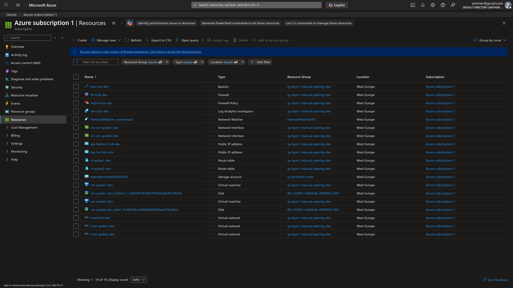
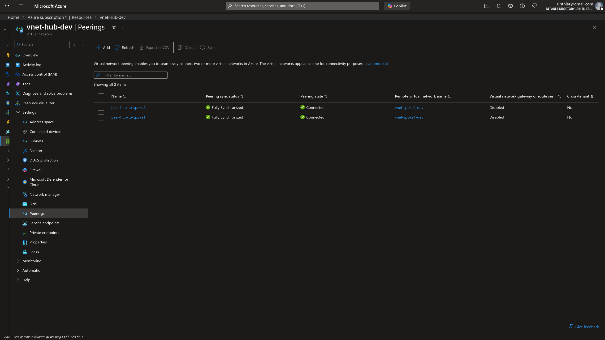
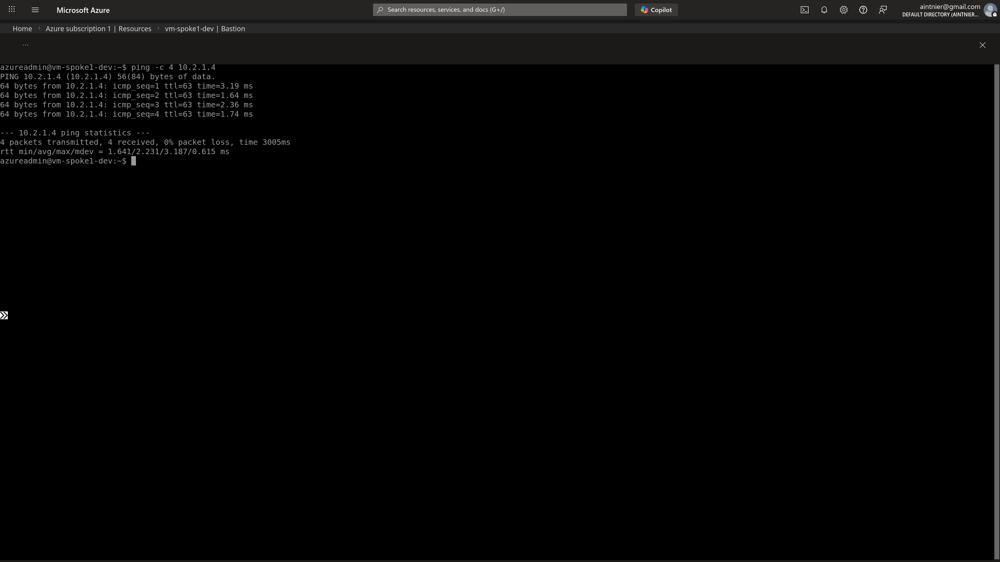
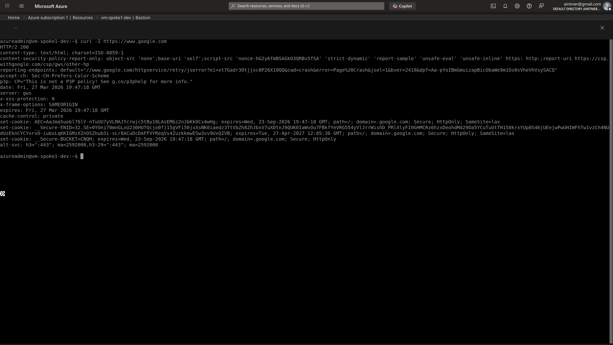
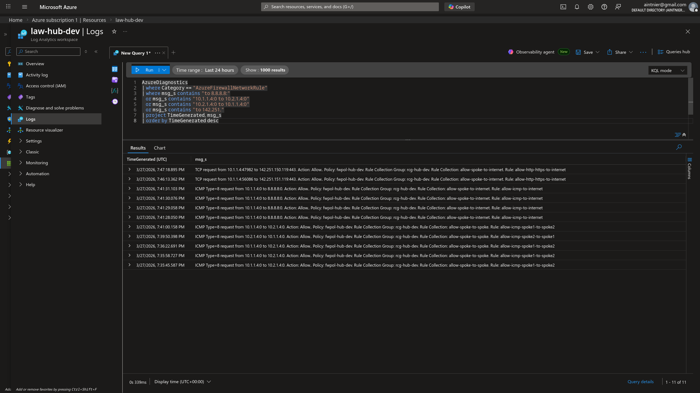
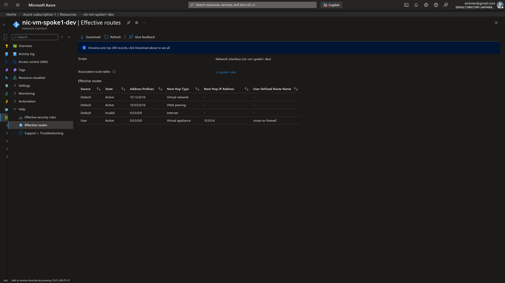
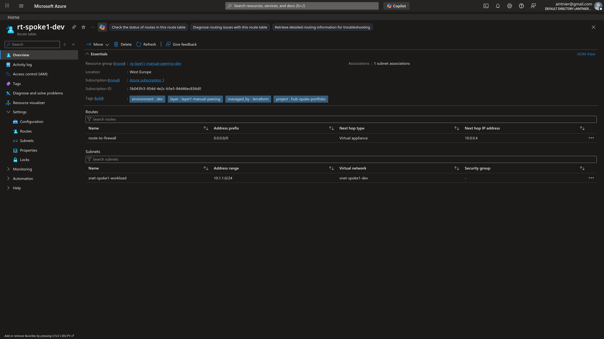
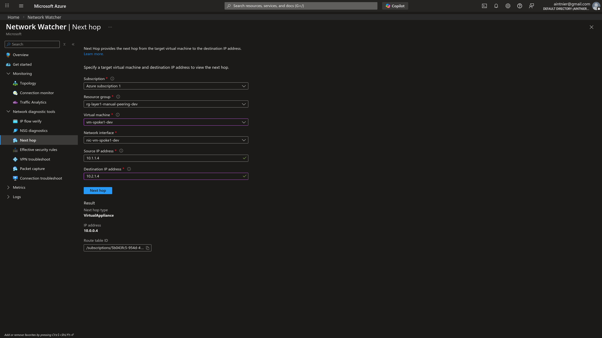
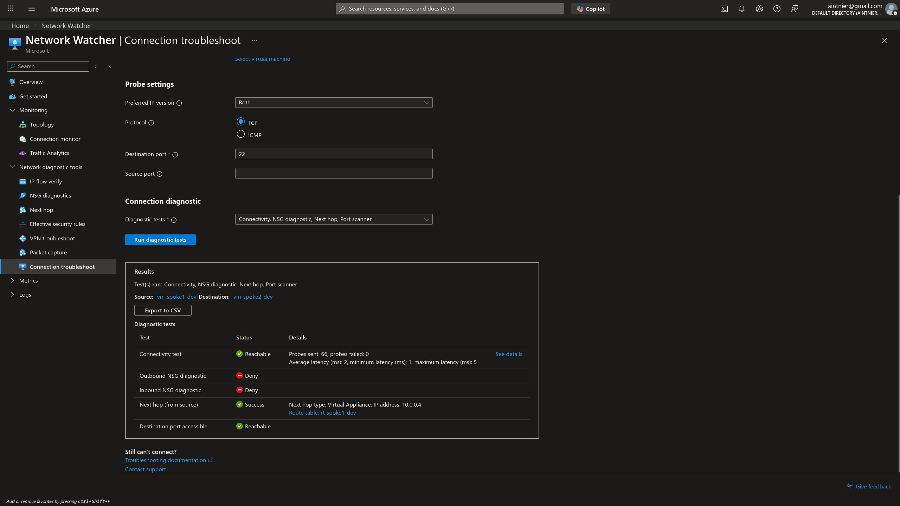

# Layer 1: Hub-and-Spoke via Manual VNet Peering

## 1. Architectural Overview & Objective

The primary objective of this phase was to establish a foundational **Hub-and-Spoke** network topology in Azure using Infrastructure as Code (Terraform). In enterprise cloud environments, isolating workloads into separate Virtual Networks (Spokes) while centralizing security and egress logic into a single point (the Hub) is the industry standard for scalability and governance.

I achieved native cross-network communication by establishing **Manual VNet Peerings** between the Spokes and the Hub, ensuring that all inter-spoke and internet-bound traffic is forcibly evaluated by a central **Azure Firewall**.

## 2. Infrastructure Setup & Network Topology

The Terraform execution successfully provisioned the virtual networks, subnets, internal route tables, and the required test Virtual Machines setup in `West Europe`.


*Architectural representation of the deployed Hub and Spoke topology generated via Azure Network Watcher.*


*A consolidated view of all resources deployed within the initial unified Resource Group, including the Bastion Host, Log Analytics Workspace, and Route Tables.*


*Verification of the successful peering state (`Connected`) linking the Hub to the individual Spoke VNets.*

---

## 3. Security Validation & Traffic Engineering

A Zero-Trust architecture requires robust validation. The routing logic was deliberately overridden using **User Defined Routes (UDR)** applied to the Spoke subnets, changing the default `0.0.0.0/0` next hop to point to the Azure Firewall's private IP (`10.0.0.4`).

### 3.1 Inter-Spoke Communication
By default, Spoke VNets do not communicate with each other. I validated that the UDRs successfully intercept the traffic and route it through the Hub's Firewall.


*ICMP (Ping) validation from Spoke 1 to Spoke 2 demonstrating successful transit and inspection by the central firewall.*

### 3.2 Controlled Internet Egress (SNAT)
For workloads that require package updates without exposing a public footprint, outbound Internet access is heavily restricted. I tested the system's ability to gracefully Source-NAT (SNAT) TCP traffic while maintaining security.


*Demonstrating successful HTTP/HTTPS egress via `curl`. The traffic is transparently SNATed by the Azure Firewall's Public IP, masking the internal VM addresses.*

---

## 4. Platform Observability & Telemetry

Modern cloud engineering relies on deep telemetry rather than manual OS-level debugging. I leveraged the **Azure Network Watcher** and **Log Analytics Workspace** to audit the network flows from the control plane.

### 4.1 Firewall Rule Evaluation (KQL)
Azure Firewall diagnostics were shipped to a Log Analytics Workspace to provide a permanent audit trail of allowed and denied traffic. 


*Executing a `Kusto Query Language (KQL)` script to explicitly filter and identify our exact testing payloads matching the Network Rules Policies.*

### 4.2 Route and Next-Hop Auditing
To definitively prove our infrastructural code functioned natively, I inspected the Azure SDN (Software Defined Networking) routing tables.


*The Effective Routes view of Spoke 1's Network Interface showing the active User Defined overrides.*


*Detail of the Route Table (UDR) configured directly on the Spoke subnet effectively imposing the routing overlay.*


*Network Watcher's Next Hop diagnostic tool analytically proving the `Virtual Appliance` target resolution.*

### 4.3 Automated End-to-End Troubleshooting
Using the Connection Troubleshoot feature, I injected synthetic probes to validate TCP Port 22 connectivity between the spokes across the Hub firewall without establishing an SSH session manually.



**Data-Driven Validation extracted from diagnostic results (CSV):**
```csv
Test,Status,Details
Connectivity test,Reachable,Probes sent: 66; probes failed: 0; Average latency (ms): 2; minimum latency (ms): 1; maximum latency (ms): 5
Next hop (from source),Success,Next hop type: Virtual Appliance; IP address: 10.0.0.4

Hop details
Name,Status,IP address,Next hop
vm-spoke1-dev,Healthy,10.1.1.4,10.0.0.0/26
fw-hub-dev,Healthy,10.0.0.0/26,10.2.1.4
vm-spoke2-dev,Healthy,10.2.1.4,
```

---

## 5. Engineering Lessons Learned

During the CI/CD pipeline execution and testing phases, several real-world engineering hurdles were resolved:

1. **Circumventing Capacity Restrictions:** The initial deployment targeting `Standard_B1s` instances encountered an immediate `409 Conflict: SkuNotAvailable` error originating from the Azure fabric due to total stock exhaustion in the West Europe region. The Terraform declarations were dynamically scaled up to General Purpose `Standard_D2s_v3` SKUs, demonstrating deployment agility and pivoting ability.
2. **Abstracting CI/CD Ephemeral Runner Dependencies:** The initial code expected an interactive local `ssh-keygen` payload. In the GitHub Actions pipeline, this caused a missing file error. This was seamlessly hotfixed by injecting an automated SSH Keygen step natively inside the pipeline runtime, thus decoupling the Terraform logic from the local developer environment.
3. **Understanding Level 4 Protocol Limitations:** Initial outbound Internet tests utilizing standard ICMP (`ping 8.8.8.8`) were dropped. Observational insights revealed that standard Azure Firewalls do not intrinsically apply SNAT translation to ICMP traffic targeting external, public IP addresses. Pivoting the test vector to a valid TCP packet (`curl`) immediately established a connection, highlighting the importance of protocol-aware testing methodologies in Cloud environments.
