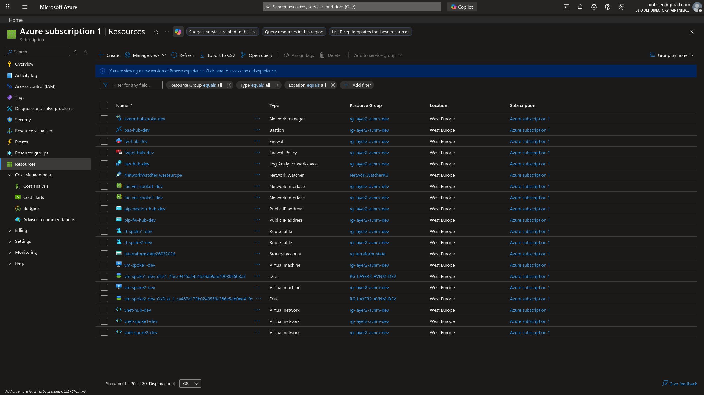
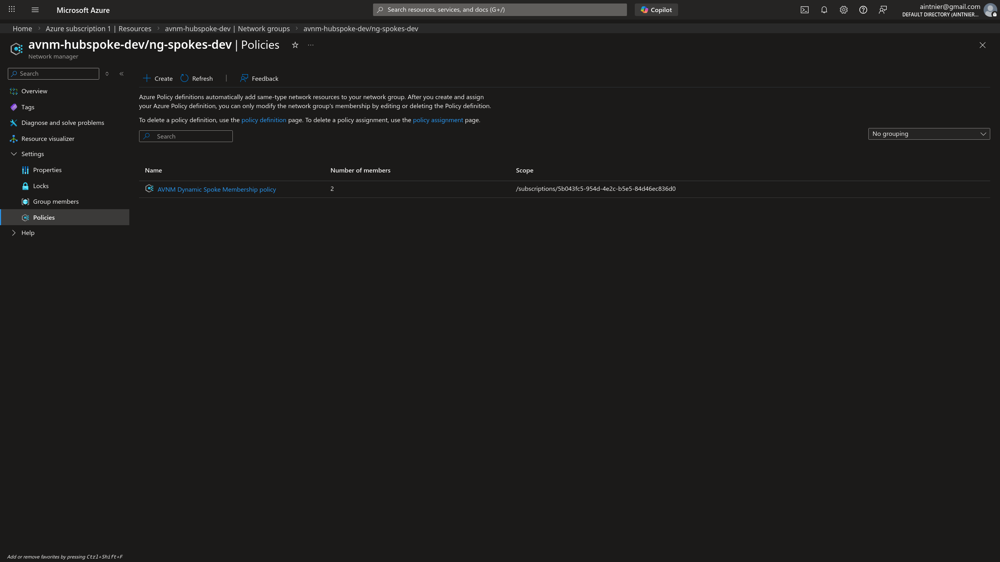
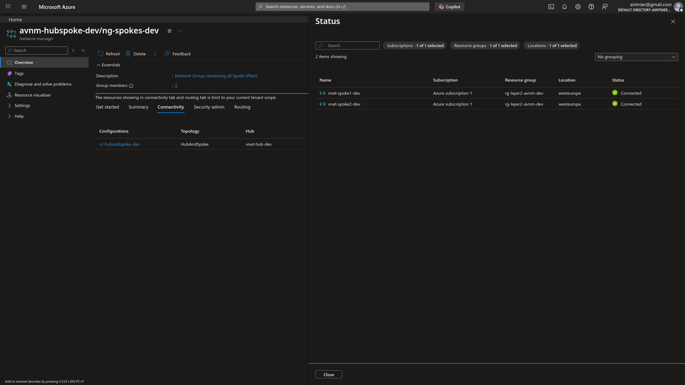
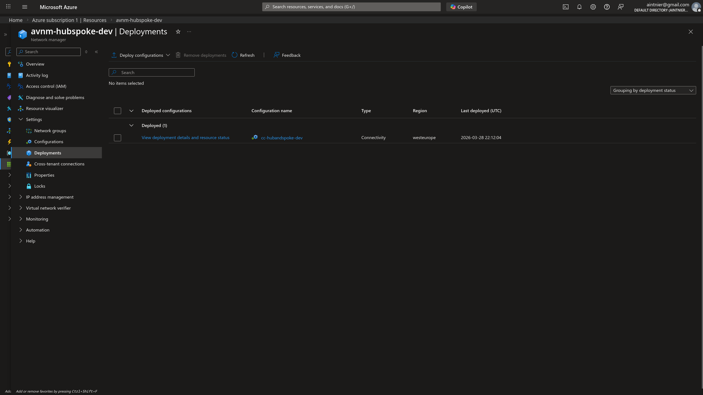
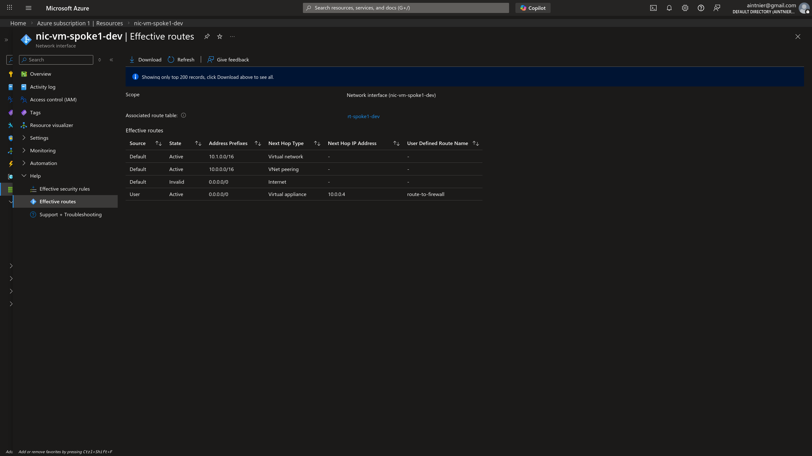
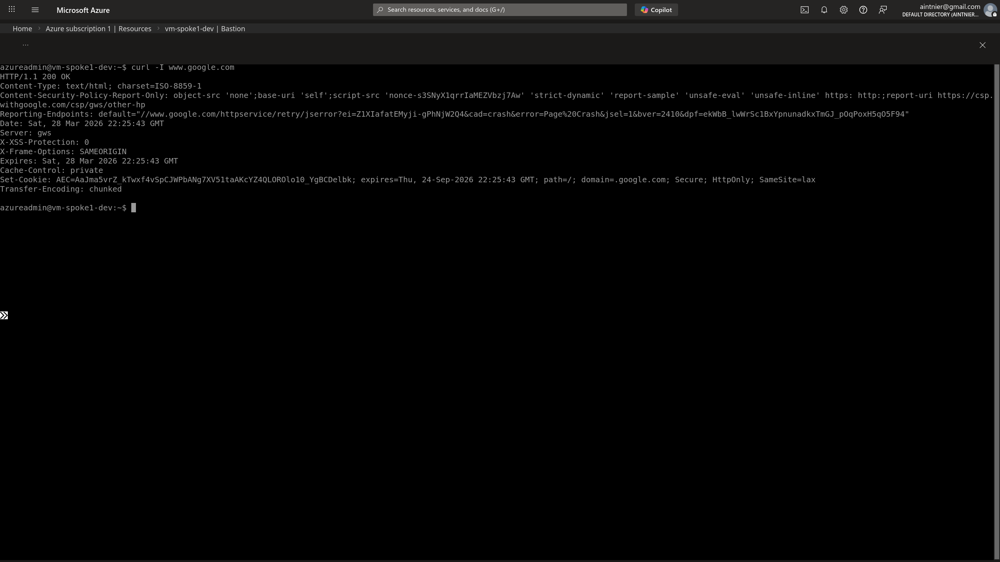
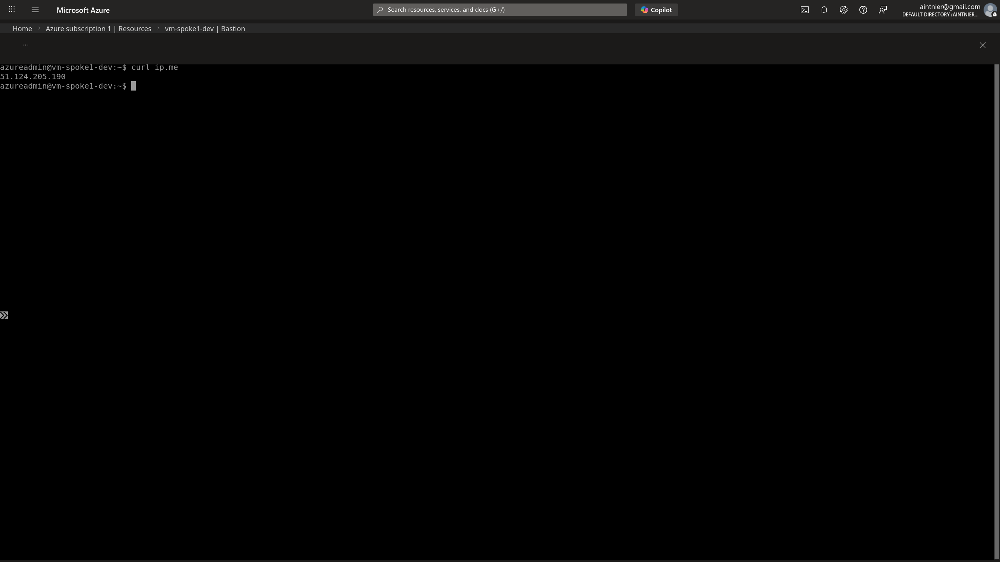
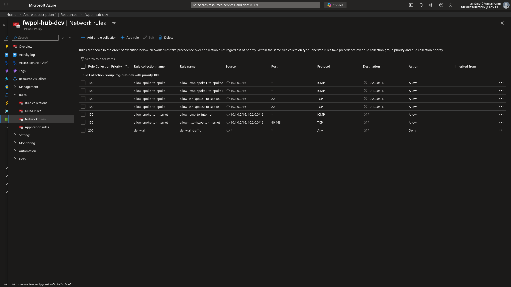
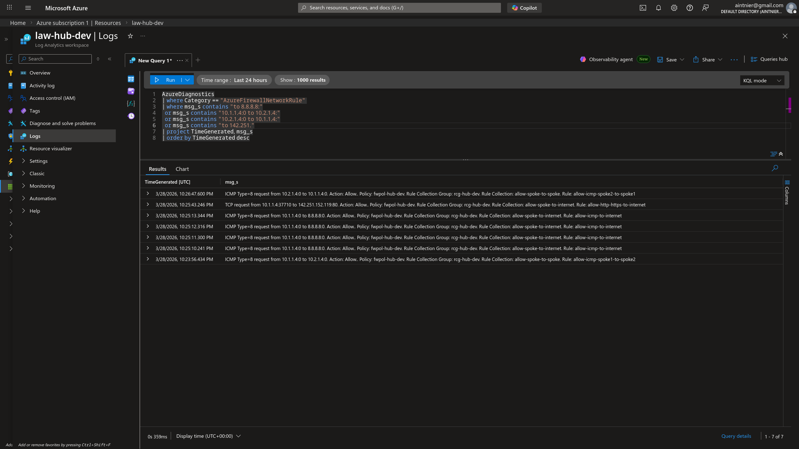
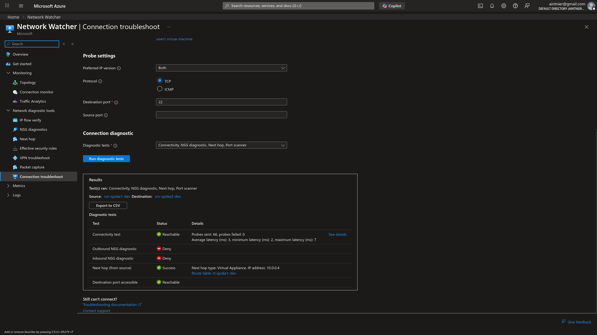

# Layer 2: Dynamic Hub-and-Spoke via Azure Virtual Network Manager (AVNM)

## 1. Architectural Overview & Objective

The main objective of this phase was to evolve the static **Hub-and-Spoke** topology created in Layer 1 into a highly scalable, dynamically managed architecture using **Azure Virtual Network Manager (AVNM)**. 

While manual VNet Peerings are suitable for small-scale footprints, enterprise environments with dozens or hundreds of spokes suffer from administrative overhead and the "n-squared" peering problem. By introducing AVNM, the infrastructure transitions from imperative peering management to declarative **Dynamic Membership**. 

### Pros vs. Cons
*   **Pros:** Enormous scalability. Spokes are automatically enrolled into the Hub-and-Spoke topology without writing explicit peering code for each one. Governance is natively enforced by Azure Policy matching specific resource tags (e.g., `avnm-group = 'hub-spoke-layer2'`). New VNets simply require the correct tag to be wired into the corporate backbone.
*   **Cons:** Additional abstraction layers add slight complexity to the initial deployment logic. Changes require AVNM control plane deployments that can take several minutes to propagate, compared to instantaneous manual peerings.

## 2. Infrastructure Setup & Network Topology

The Terraform state automatically provisioned the Hub, Spokes, and a centralized AVNM instance. Instead of looping through manual peering resources, an Azure Policy automates the network enrollments.


*Architectural representation of the AVNM Hub and Spoke topology generated via Azure Network Watcher.*


*A consolidated view of the deployed resources scoped within the Resource Group, highlighting the AVNM instances alongside the networking backbone.*

### 2.1 Dynamic Group Membership

Instead of specifying IPs or Object IDs, VNets join the Network Group dynamically via an Azure Policy definition.


*The custom Azure Policy built for AVNM to govern dynamic membership of the Spoke VNets.*


*Verification of the successful peering state (`Connected`) showing Spoke 1 and Spoke 2 automatically and successfully enrolled into the central AVNM Network Group.*


*The AVNM Deployment status proving the configurations have been pushed globally to the Azure fabric.*

---

## 3. Security Validation & Traffic Engineering

Just as in Layer 1, maintaining Zero-Trust boundaries is paramount. The routing logic overrides the default Next Hop utilizing User Defined Routes (UDR) applied precisely to the workloads, steering `0.0.0.0/0` to the Firewall (`10.0.0.4`).

### 3.1 Route Tables and Access


*The Effective Routes of the Spoke 1 Network Interface, showing AVNM injected rules overridden locally by our UDR to force traffic to the Hub's NVA.*

### 3.2 Controlled Internet Egress and SNAT

Outbound Internet access is restricted. The traffic transparently traverses the Firewall, undergoing Source-NAT (SNAT), allowing requests out but masking the internal VM's origin. 


*Demonstrating successful HTTP/HTTPS egress via `curl -I www.google.com`.*


*Executing `curl ip.me` dynamically verifies the SNAT capability. The output reflects the Azure Firewall's Public IP (`51.124.205.190`), decisively proving the internal Spoke IP is successfully masked and isolated.*

---

## 4. Platform Observability & Telemetry

I relied heavily on **Azure Network Watcher** and **Log Analytics** to prove the automated AVNM peerings facilitated the exact same level of granular traffic steering as manual administration.

### 4.1 Firewall Rule Evaluation (KQL)

By streaming the Firewall diagnostic settings directly to a Log Analytics Workspace, we maintain a robust audit trail.


*The specific Azure Firewall Network Rule policies dictating routing logic.*


*Running a dedicated `Kusto Query Language (KQL)` script targeting the `AzureFirewallNetworkRule` category to audit the raw ICMP ping payloads being correctly Allowed by the NVA.*

### 4.2 Automated End-to-End Troubleshooting

Using Network Watcher capabilities, an exhaustive TCP Port 22 connectivity check was triggered across the Spoke networks. 



**Data-Driven Validation extracted from diagnostic results (CSV):**
```csv
Test,Status,Details
Connectivity test,Reachable,Probes sent: 66; probes failed: 0; Average latency (ms): 3; minimum latency (ms): 2; maximum latency (ms): 7
Next hop (from source),Success,Next hop type: Virtual Appliance; IP address: 10.0.0.4

Hop details
Name,Status,IP address,Next hop
vm-spoke1-dev,Healthy,10.1.1.4,10.0.0.0/26
fw-hub-dev,Healthy,10.0.0.0/26,10.2.1.4
vm-spoke2-dev,Healthy,10.2.1.4,
```

---

### 4.3 Idempotency and Deployment Triggers in AVNM

The `triggers` block added to the `azurerm_network_manager_deployment` resource acts as a **safeguard measure to guarantee the idempotency and consistency** of Layer 2.

#### Why is it necessary?
In Azure, the **Virtual Network Manager (AVNM)** separates the definition of the configuration from its actual application ("Deployment"):
1.  **Configuration:** Defines the Hub-and-Spoke topology (in `cc-hubandspoke`).
2.  **Deployment:** Is the action that "publishes" that configuration to the VNets in the subscription.

The problem is that Terraform, by its nature, tracks the state of resources. If you modify a parameter in the configuration, Terraform updates that resource correctly, but it might not understand that it also needs to **re-execute the deployment** to make the changes effective on Azure, because the direct arguments of the deployment (like the Network Manager ID) haven't changed.

#### What does it specifically do?
```hcl
  triggers = {
    configuration_ids = join(",", [azurerm_network_manager_connectivity_configuration.hub_and_spoke.id])
  }
```
*   **Monitoring:** Forces Terraform to consider the `deployment` resource as "changed" whenever the connectivity configuration ID changes.
*   **Idempotency:** If there are no changes in the configuration, the value in the `triggers` block remains identical and Terraform will do nothing (respecting the **NFR-03** requirement from the PRD).
*   **Guaranteed execution:** If you modify something in the network logic, the `triggers` "wakes up" the deployment resource, ensuring that the publication action is sent to Azure during the same `terraform apply`.

Without this block, you could end up in a situation where Terraform tells you everything is updated, but the VNets on Azure are still using an old version of the topology because the "publish command" (the deployment) was not triggered.

## 5. Engineering Lessons Learned

Transitioning from declarative manual infrastructure to dynamic orchestration exposed a few architectural nuances that required proactive engineering:

1. **AVNM Gateway Configuration Conflicts (The "Not Connected" Bug):** Once initially deployed, the AVNM configuration appeared technically sound but remained in a perpetually stalled "Not connected" state within the peerings. Through targeted debugging, I discovered this was caused by the Terraform block parameter `use_hub_gateway = true`. In our architecture, the Hub centralizes traffic through a Software NVA (Azure Firewall), but *does not actually possess* a dedicated Virtual Network Gateway (VPN/ExpressRoute). By rectifying this logical mismatch and explicitly setting `use_hub_gateway = false`, AVNM successfully established the cross-vnet peerings.
2. **Forcing Terraform State Updates for AVNM:** Unlike standard resources, modifying the internal configuration blocks of an `azurerm_network_manager_connectivity_configuration` does not always natively trigger the `azurerm_network_manager_deployment` resource, because the underlying ID of the configuration object doesn't change. I implemented an intentional trigger mechanism inside Terraform (`force_update = "1"`) to forcefully push a sync to the Azure fabric.
3. **RBAC Authorisation Delays:** Implementing dynamic AVNM policies requires the provisioning Terraform Service Principal to dynamically manipulate Azure Policies on the fly. This initially generated a `403 AuthorizationFailed` error from the Azure API due to insufficient privileges. Exposing and ensuring the appropriate **"Resource Policy Contributor"** scoped permissions via Terraform solved the pipeline failure, highlighting the crucial importance of granular RBAC design when scaling security automation.
