# Layer 3: Global Hub-and-Spoke via Azure Virtual WAN (vWAN)

## 1. Architectural Overview & Objective

The primary objective of this final phase was to evolve the Azure infrastructure into a highly scalable, globally managed architecture using **Azure Virtual WAN (vWAN)**. 

While manual peerings (Layer 1) and AVNM (Layer 2) are effective for regional topologies, Virtual WAN is the industry standard for enterprise organizations requiring a unified, global transit architecture. By deploying a **Secured Virtual Hub**, I integrated the Azure Firewall natively into the vWAN Hub, fully automating route propagation across all connected spokes via **Routing Intent**. 

This paradigm completely eliminates the operational overhead of maintaining custom User Defined Routes (UDRs) locally on the VNets, enforcing a Zero-Trust security boundary organically from the control plane.

### Pros vs. Cons
Compared to Layer 1 (Manual Peering) and Layer 2 (AVNM Dynamic Membership), Virtual WAN introduces a fundamentally different approach:
*   **Pros:** Native global scale and unified transit architecture without the need for bespoke UDRs or Policy-based automated peering logic. Built-in, fully managed components (Router, Firewall, VPN Gateways). With Routing Intent enabled, security rules apply universally and natively across all Spoke attachments, greatly simplifying enrollment. Site-to-Site and Hub-to-Hub connectivity across regions is completely automatic compared to AVNM which still requires manual hub peerings.
*   **Cons:** Highest cost of entry (monthly recurring charge just for the Virtual Hub and Managed NVA). Slower provisioning times than standard VNets. Loss of granular micro-segmentation control at the lowest routing level (Routing Intent applies a blanket `0.0.0.0/0` default route to all connected VNets, requiring architectural workarounds like opting-out specific management subnets to prevent traffic drops).

## 2. Infrastructure Setup & Network Topology

The Terraform state seamlessly provisioned the new Virtual WAN construct, including the Virtual Hub and the natively managed Secured Firewall.


*Architectural representation of the globally managed Hub and Spoke topology generated via Azure Network Watcher.*

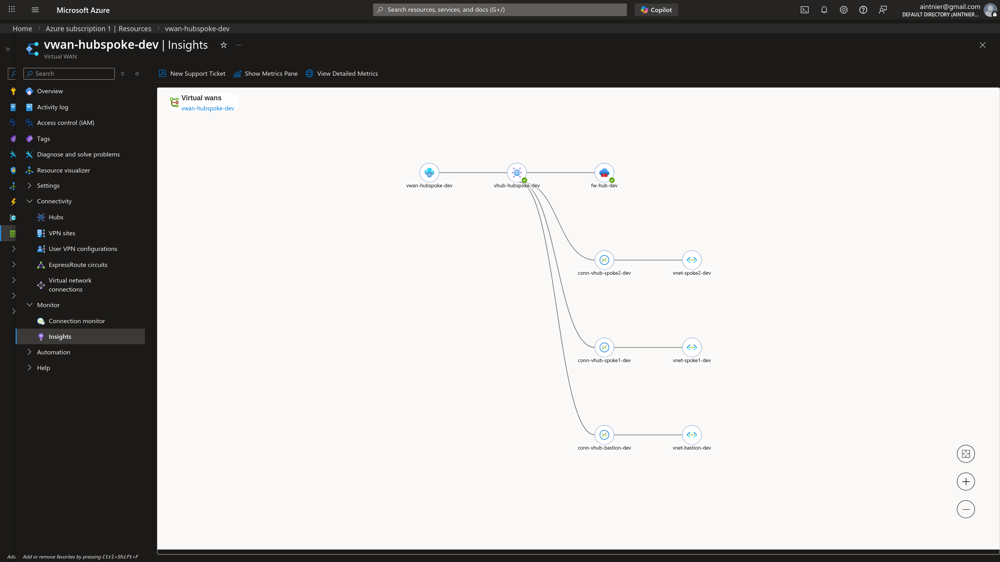
*A logical view of the vWAN topology from Azure Monitor Insights, illustrating the Managed Hub serving as the transit point for the Spoke VNets.*

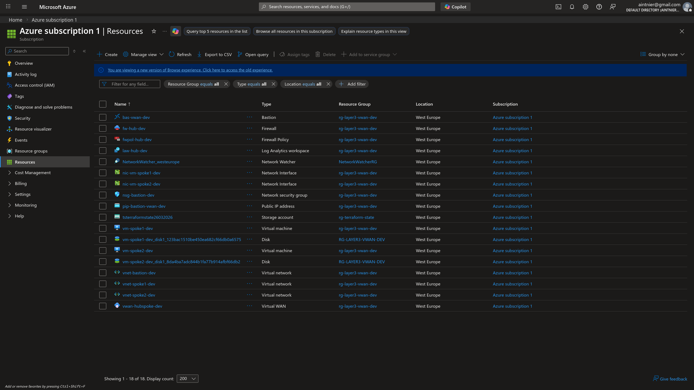
*A consolidated view of all resources deployed, showcasing the Virtual WAN and the native Hub resources.*

### 2.1 Secured Virtual Hub Provisioning

Instead of deploying a standalone Virtual Appliance in a standard Hub VNet, the Azure Firewall was provisioned as an integrated component of the Virtual Hub.

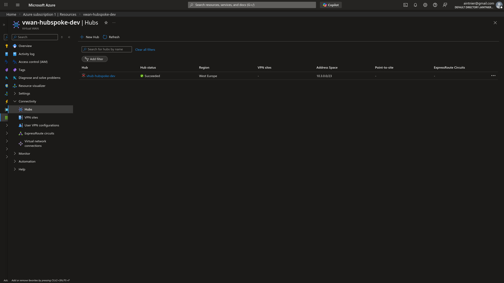
*The vWAN Hubs blade verifying the deployment of the Managed Hub.*

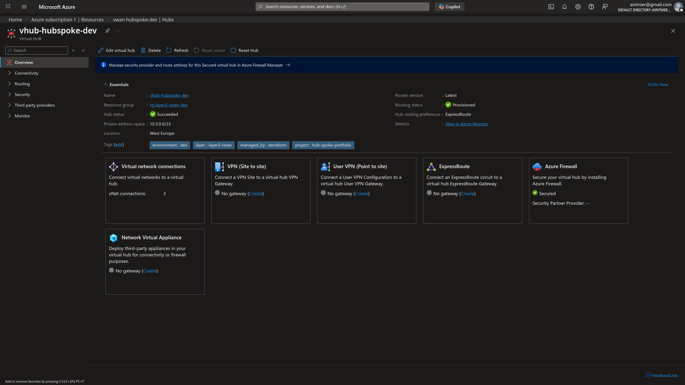
*Confirmation of the successful deployment state (`Succeeded`) of the Virtual Hub and its managed router.*

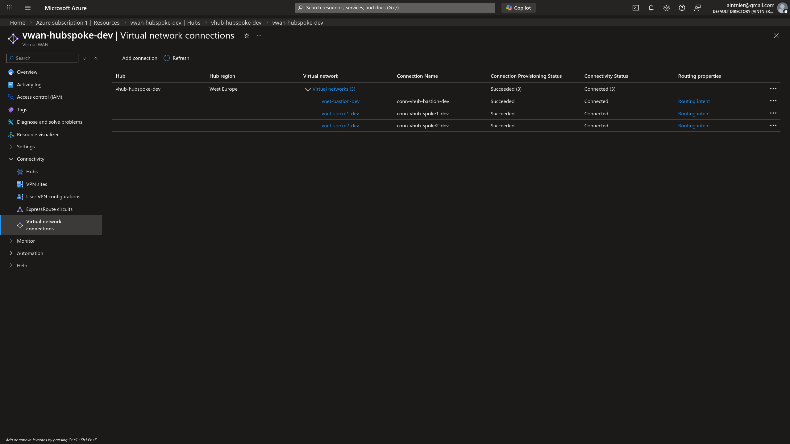
*The explicit Virtual Network Connections attaching the VNets directly to the vWAN Hub, completely replacing traditional peering configurations.*

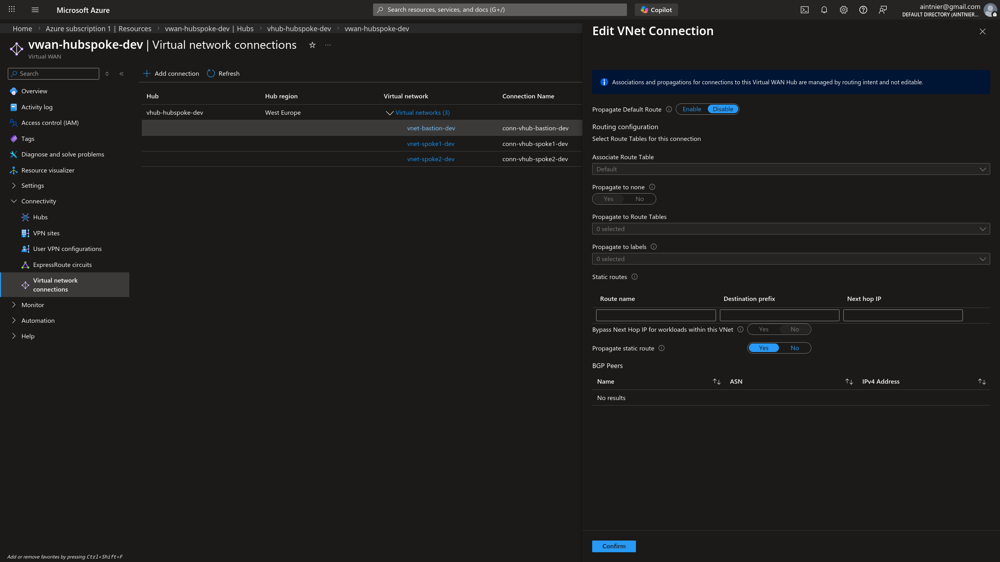
*Crucial Architectural Decision: The Internet Security propagation for the dedicated Bastion VNet Connection is explicitly **Disabled** to prevent asynchronous default-route injection that would sever Bastion data-plane access.*

---

## 3. Security Validation & Traffic Engineering

In a Secured Virtual Hub, Zero-Trust is enforced implicitly. The mechanism responsible for this is **Routing Intent & Routing Policies**. This feature automatically programs the Virtual Hub's router to intercept and redirect all private and public traffic flows into the embedded Azure Firewall.

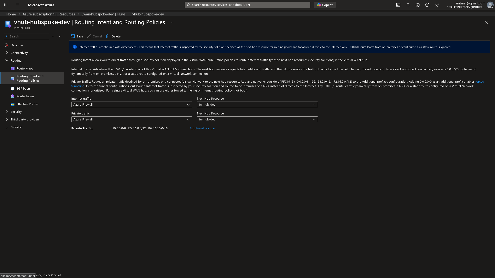
*The Routing Intent configuration forcibly steering both Private Traffic (RFC 1918) and Internet Traffic to the internal Azure Firewall construct.*

### 3.1 Seamless Routing (The Death of UDRs)

Because Routing Intent is active, the Spoke VNets are dynamically programmed with the correct pathways to the NVA without declaring a single User Defined Route (UDR) in Terraform. The route table overhead is completely abstracted.

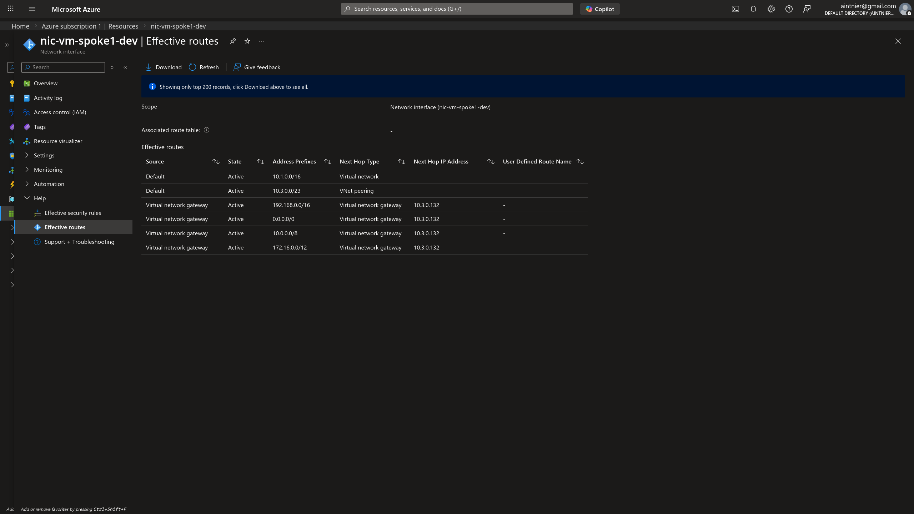
*The Effective Routes of the Spoke 1 Network Interface. Notice the absence of `User` types. The default route `0.0.0.0/0` and intra-spoke prefixes are natively injected with a Next Hop type of **Virtual Network Gateway**.*

### 3.2 Azure Firewall Manager and IP-Based Bastion Access

Security policies for a Secured Virtual Hub are managed through the centralized **Azure Firewall Manager**.

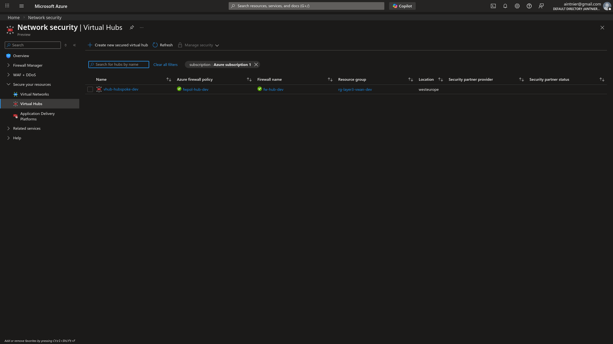
*The Azure Firewall Manager identifying the deployment exactly as a `Secured Virtual Hub`, fundamentally distinguishing it from a standard virtual network firewall.*

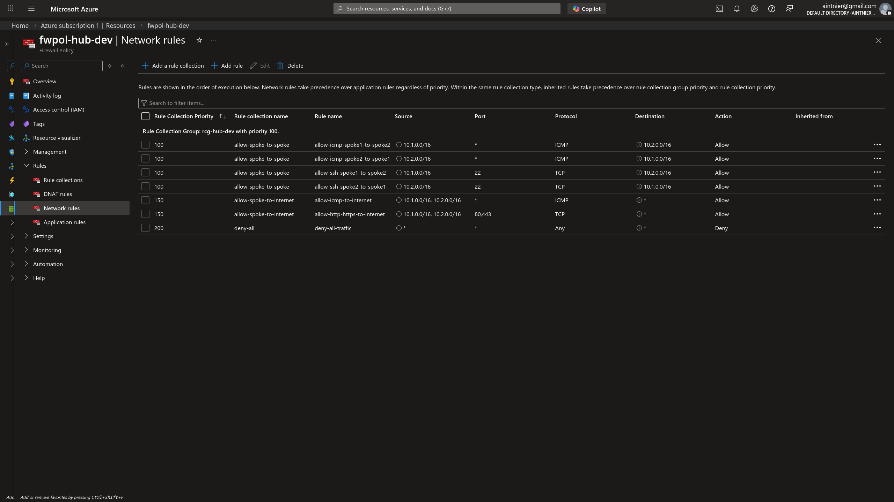
*The network rule collections dictating explicitly what traffic is permitted traversing the vWAN backbone.*

Because the Bastion Host was deliberately isolated into a dedicated VNet without `internet_security_enabled`, it protects the inbound management connection. To reach the isolated Spoke VMs, I leveraged **IP-based connections** (requiring Bastion Standard SKU) rather than Resource IDs. 

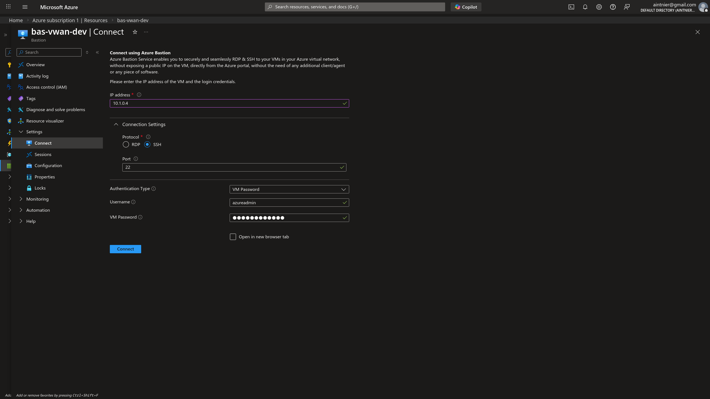
*Connecting to the Spoke workload dynamically via manual Private IP injection through the Bastion Standard interface.*

---

## 4. Platform Observability & Telemetry

Once again, I leveraged Azure Network Watcher to definitively validate the traffic pathing through the newly managed SDN configuration.

### 4.1 Automated End-to-End Troubleshooting & Next-Hop Verification

To verify that packets flow deeply through the vWAN router before reaching the internet or neighboring spokes, Next-Hop and Connection queries were processed.


*Diagnostic confirming the Next Hop from Spoke 1 targeting `8.8.8.8` routes cleanly to the Virtual Network Gateway's internal IP (`10.3.0.132`).*

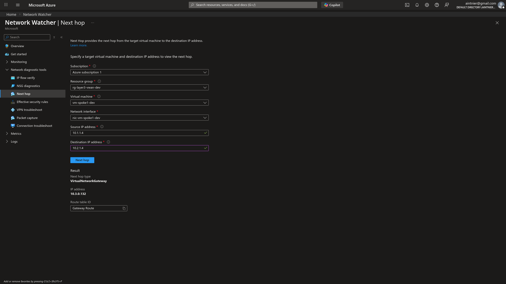
*Inter-spoke traffic similarly routes successfully into the Hub's Managed Router.*

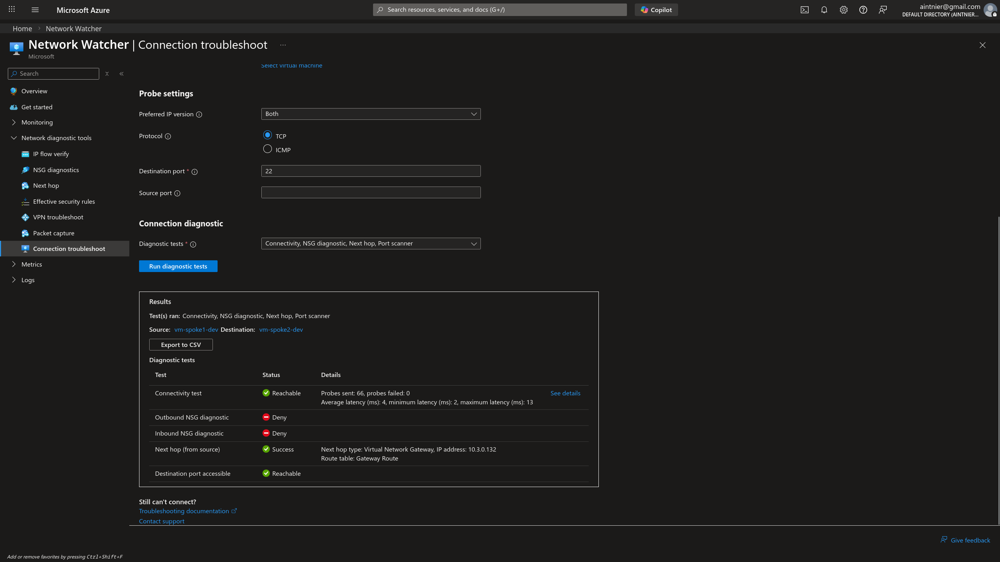

**Data-Driven Validation extracted from diagnostic results (CSV):**
```csv
Test,Status,Details
Connectivity test,Reachable,Probes sent: 66; probes failed: 0; Average latency (ms): 4; minimum latency (ms): 2; maximum latency (ms): 13
Next hop (from source),Success,Next hop type: Virtual Network Gateway; IP address: 10.3.0.132

Hop details
Name,Status,IP address,Next hop
vm-spoke1-dev,Healthy,10.1.1.4,10.3.0.132
Virtual Network Gateway,Healthy,10.3.0.132,10.2.1.4
vm-spoke2-dev,Healthy,10.2.1.4,
```

### 4.2 Data Plane Validation (Permit vs Deny)

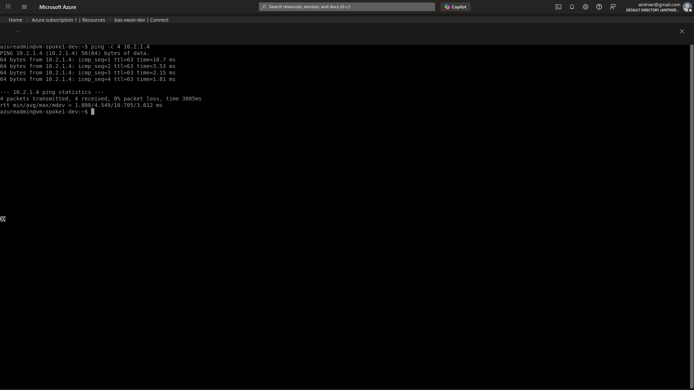
*ICMP (Ping) validation from Spoke 1 to Spoke 2 explicitly permitted.*

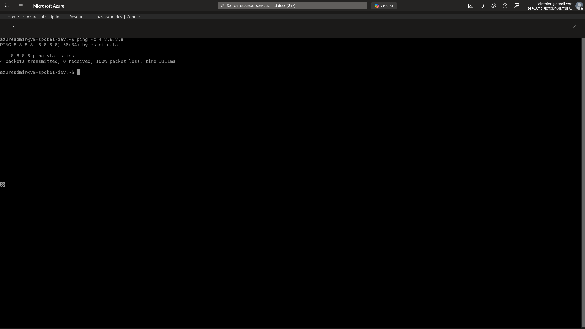
*An arbitrary ICMP request falling outside of the explicit Firewall Network policies is actively dropped by the NVA, enforcing Zero Trust.*

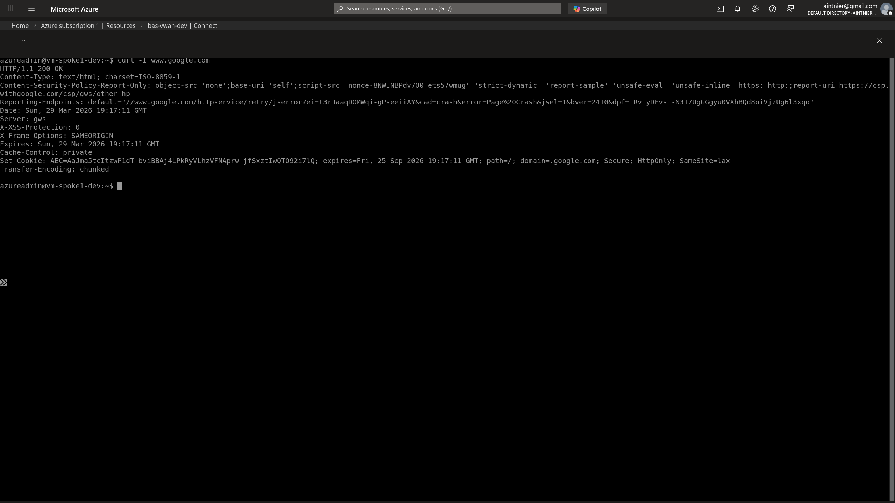
*Demonstrating successful HTTP/HTTPS egress via `curl -I www.google.com`. The traffic is implicitly Source-NATed by the Managed Firewall.*

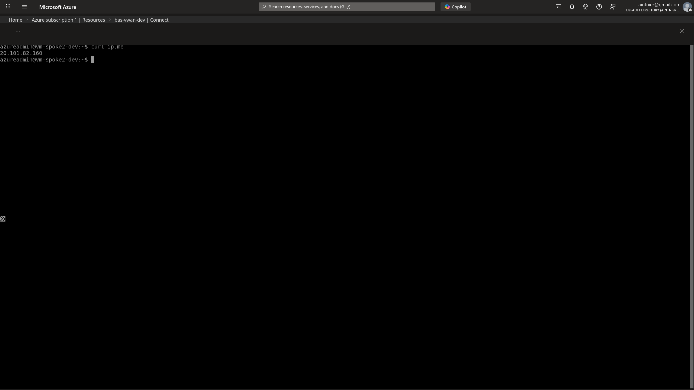
*Executing `curl ip.me` dynamically verifies the SNAT capability. The output reflects the Azure Firewall's Public IP, proving the internal Spoke IP is successfully masked and isolated.*

### 4.3 Firewall Rule Evaluation (KQL)

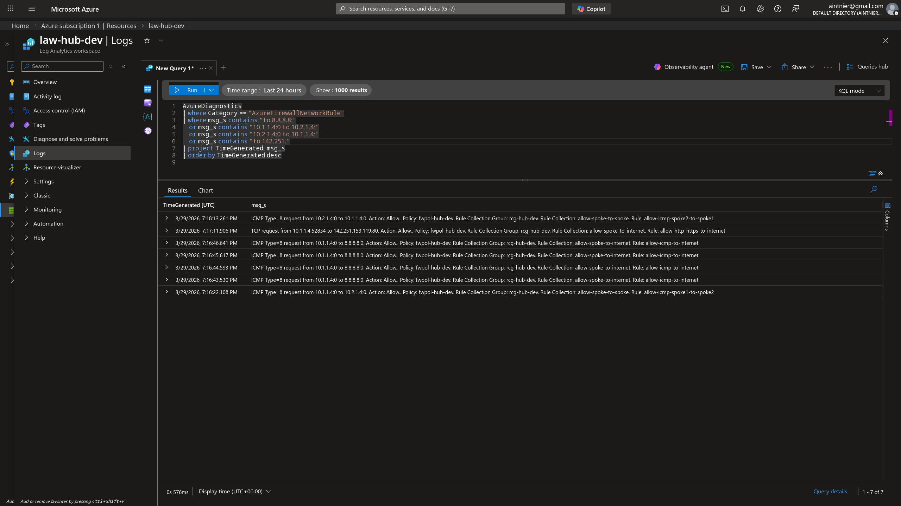
*The final `Kusto Query Language (KQL)` script selectively analyzing the `AzureFirewallNetworkRule` diagnostic logs, proving definitively that our payload traffic was inspected, classified, and respectively Allowed or Denied by the Secured Hub's intrinsic rule collections.*

---

## 5. Engineering Lessons Learned

Transitioning from a traditional Hub-and-Spoke to a highly-abstracted Azure Virtual WAN uncovered several critical architectural behaviors:

1. **Routing Intent Propagates Default Routes Asymmetrically to Bastion**: When enabling `Private Traffic` and `Internet Traffic` on the vWAN Routing Intent, the Hub automatically propagates a `0.0.0.0/0` default route to all connected VNets. Because an Azure Bastion Host absolutely requires its inbound management path from the public internet to remain symmetric, injecting a `0.0.0.0/0` route forcing its return traffic into the Firewall instantly breaks Bastion connectivity, stalling it in a *Failed* state. This was engineered around by explicitly setting `internet_security_enabled = false` specifically on the `azurerm_virtual_hub_connection` for the Bastion VNet, quarantining it from the global zero-route injection.
2. **Bastion "IP-Based Connections" Require Standard SKU**: To connect from our segregated Bastion VNet to the workload Spokes across the Firewall, I could no longer rely on the default dropdown interface which assumes direct VNet-to-VNet peering visibility. I solved this by utilizing the "IP-based Connection" feature. However, this feature is fundamentally unavailable on the *Basic* SKU of Azure Bastion, actively forcing an infrastructure uplift to *Standard* to maintain our isolated management plane architecture.
3. **Explicit Firewall Policies for Bastion-to-Spoke Data Plane**: While Layer 1 and 2 often utilize implicit internal routing logic by virtue of `Virtual Appliance` UDRs, a vWAN Secured Virtual Hub operates tightly under an intrinsic `Deny-All` stance. Upon attempting to SSH from Bastion into a Spoke VM, the connection timed out. Deep-dive debugging revealed that because the Spoke is governed by the Secured Hub's Routing Intent, the **inbound** management traffic from the Bastion VNet (`10.4.0.0/24`) was being actively dropped by the Firewall upon arrival. This required hotfixing the central `azurerm_firewall_policy_rule_collection_group` to explicitly inject a `network_rule_collection` permitting TCP/22 and TCP/3389 originating precisely from the Bastion namespace into the Spoke namespaces. The final Terraform configuration thus includes an additional `network_rule_collection` (`allow-bastion-to-spokes`) explicitly allowing TCP/22 and TCP/3389 from `10.4.0.0/24` (Bastion subnet) to the Spoke address spaces, ensuring the underlying Infrastructure-as-Code clearly delegates this access.